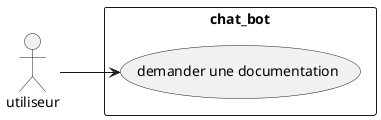

# stage première année
durant ce stage j'ai dut créer un chat bot pour une application qu'utilise les employer de carrefour pour leur facilité la recherche d'information ce chat bot je l'ai fait en html, css, java script, mais j'ai aussi utiliser des aplication que carefour a déveloper pour programmer leur chat bot

